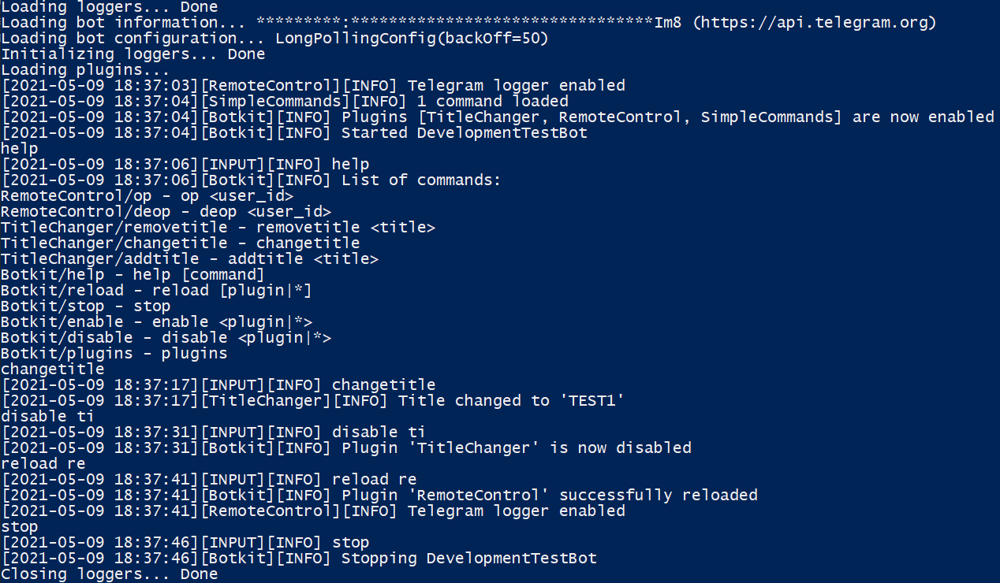

# Botkit
Botkit is a program, and a framework that helps to create modular [Telegram Bots](https://core.telegram.org/bots).

# Gradle
```groovy
plugins {
    id 'org.jetbrains.kotlin.jvm' version '1.5.0'
    id 'org.jetbrains.kotlin.plugin.serialization' version '1.5.0'
}

repositories {
    maven { url 'https://jitpack.io' }
}

dependencies {
    implementation 'com.github.AgeOfWar:Botkit:2.1'
}
```

# Usage
```text
Usage: java -jar ${programFile.name} [options]
where options include:
    -token=<token> overrides token in bot.json
    -? -h -help prints this help message to the output stream
```

# Example


# Available commands
```text
disable <plugin|*>  - disables plugin or all plugins
enable <plugin|*>   - enables plugin or all plugins
reload [plugin|*]   - reloads plugin or all plugins
plugins             - shows enabled and available plugins
stop                - stops botkit
help                - shows list of commands
```
Plugins can add custom commands

# Plugin Example
This plugin re-sends messages

```kotlin
package com.example.myplugin

import com.github.ageofwar.botkit.plugin.*
import com.github.ageofwar.ktelegram.*

class MyPlugin : Plugin() {
    override suspend fun init() {
        registerUpdateHandlers(RepeatCommand(this))
    }
}

class RepeatCommand(private val plugin: Plugin) : PluginUpdateHandler {
    override suspend fun Plugin.handle(update: Update) = update.handleMessage { message ->
        val content = message.toMessageContent()
        if (content != null) {
            plugin.api.sendMessage(message.messageId, content)
        }
    }
}
```

Remember to add `botkit.properties` file in your resource source set:
```properties
name=MyPlugin
pluginClassName=com.example.myplugin.MyPlugin
apiVersion=2.1
```

| Botkit version | apiVersion | supported apiVersion |
|----------------|------------|----------------------|
| 2.1            | 2.1        | 2.0, 2.1             |
| 2.0            | 2.0        | 2.0                  |
| 1.3            | 1.3        | 1.0, 1.2, 1.3        |
| 1.2            | 1.2        | 1.0, 1.2             |
| 1.1            | 1.0        | 1.0                  |
| 1.0            | 1.0        | 1.0                  |

## Some utility functions

| Function                                                                           | Description                                                                           |
|------------------------------------------------------------------------------------|---------------------------------------------------------------------------------------|
| `Plugin.registerUpdateHandler(UpdateHandler)                                     ` | registers a handler for [Telegram updates](https://core.telegram.org/bots/api#update) |
| `Plugin.registerConsoleCommand(PluginCommand)                                    ` | registers a handler for console commands                                              |
| `Plugin.registerLogger(PluginLogger)                                             ` | registers a botkit logger                                                             |
| `Plugin.dispatchConsoleCommand(String)                                           ` | executes a console command                                                            |
| `Plugin.log(String?) / Plugin.warning(String?) / Plugin.error(String?,Throwable?)` | logging methods                                                                       |
| `Plugin.withPlugin<reified T : Plugin>(T.() -> R): R                             ` | uses external plugin                                                                  |
| `Plugin.readFile(...) / Plugin.readFileOrCopy(...)                               ` | utility method for plugin data reading                                                |
| `Plugin.writeFile(...)                                                           ` | utility method for plugin data writing                                                |
| `Plugin.readJsonFileAs(...) / Plugin.writeFile(...)                              ` | utility methods for json data reading/writing                                         |
| `String.template(vararg Pair<String, Any?>): String                              ` | formats a string, see [Freemarker](https://freemarker.apache.org/docs/index.html)     |

## commands.txt
```text
kick  - kicks an user
help  - shows an help message
hello - says hello
```
Adding this file into plugin data folder will update your bot commands when the plugin is enabled.
